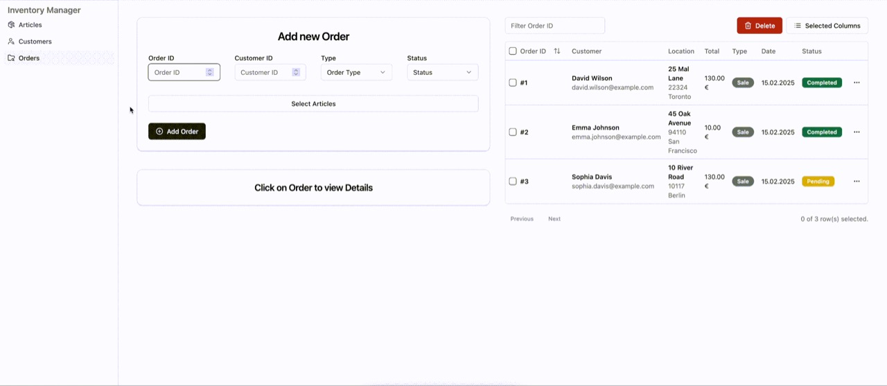

# Inventory Manager

A web-based inventory management tool written in Rust and React. It links
articles, customers, and orders, tracks stock levels, imports records, and
generates PDF invoices through a REST API and browser dashboard.

## Why this project exists

This project explores full-stack Rust services, structured inventory workflows,
SQLite-backed persistence, API documentation, and PDF invoice generation for
small business-style operations.

## Features

- Article and customer management
- CSV import for inventory and customer records
- Order processing with automated PDF invoice generation
- Stock-level tracking
- REST API with Swagger UI documentation
- React/Vite dashboard for articles, customers, and orders

## Tech Stack

- Rust, Tokio, Axum
- SQLite, rusqlite, r2d2
- utoipa, Swagger UI
- headless_chrome, printpdf
- React, TypeScript, Vite
- Tailwind CSS, shadcn/ui
